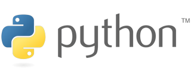

	
	<h2>Python - Notas de Estudo</h2>
	<h3>⬝&nbsp; Tela Inicial &nbsp;⬝</h3>
&nbsp;
&nbsp;	

Link  | Tópico
:---: | :---
[01](https://github.com/michelelozada/Python-Study-Notes/blob/main/files/tipos-de-dados.md) | Tipos de dados   
[02](https://github.com/michelelozada/Python-Study-Notes/blob/main/files/strings.md) | Strings  
[03](https://github.com/michelelozada/Python-Study-Notes/blob/main/files/listas.md) | Listas   
[04](https://github.com/michelelozada/Python-Study-Notes/blob/main/files/tuplas.md) | Tuplas
[05](https://github.com/michelelozada/Python-Study-Notes/blob/main/files/dicionarios.md) | Dicionários
[06](https://github.com/michelelozada/Python-Study-Notes/blob/main/files/sets.md) | Sets (conjuntos de dados)
[06](https://github.com/michelelozada/Python-Study-Notes/blob/main/files/range.md) | Range (intervalos)
[07](https://github.com/michelelozada/Python-Study-Notes/blob/main/files/operadores-aritmeticos.md) | Operadores aritméticos   
[08](https://github.com/michelelozada/Python-Study-Notes/blob/main/files/operadores-atribuicao.md) | Operadores de atribuição   
[09](https://github.com/michelelozada/Python-Study-Notes/blob/main/files/operadores-relacionais.md) | Operadores relacionais   
[10](https://github.com/michelelozada/Python-Study-Notes/blob/main/files/operadores-logicos.md) | Operadores lógicos   
[11](https://github.com/michelelozada/Python-Study-Notes/blob/main/files/08-estrutura-sequencial.md) | Estrutura sequencial   
[12](https://github.com/michelelozada/Python-Study-Notes/blob/main/files/09-desvio-condicional-simples.md) | Desvio condicional simples   
[13](https://github.com/michelelozada/Python-Study-Notes/blob/main/files/10-desvio-condicional-composto.md) | Desvio condicional composto  
[14](https://github.com/michelelozada/Python-Study-Notes/blob/main/files/11-desvio-condicional-aninhado.md) | Desvio condicional aninhado  
[15](https://github.com/michelelozada/Python-Study-Notes/blob/main/files/12-desvio-condicional-encadeado.md) | Desvio condicional encadeado   
[16](https://github.com/michelelozada/Python-Study-Notes/blob/main/files/13-variavel-contadora.md) | Variável contadora 
[17](https://github.com/michelelozada/Python-Study-Notes/blob/main/files/14-variavel-acumuladora.md) | Variável acumuladora   
[18](https://github.com/michelelozada/Python-Study-Notes/blob/main/files/15-laco-for.md) | Estrutura de controle - Laço For  
[19](https://github.com/michelelozada/Python-Study-Notes/blob/main/files/16-laco-while.md) | Estrutura de controle - Laço While  
[20](https://github.com/michelelozada/Python-Study-Notes/blob/main/files/17-continue-e-break.md) | Comandos continue e break  
[21](https://github.com/michelelozada/Python-Study-Notes/blob/main/files/18-operador-logico-and.md) | Operador lógico AND   
[22](https://github.com/michelelozada/Python-Study-Notes/blob/main/files/19-operador-logico-or.md) | Operador lógico OR 
[23](https://github.com/michelelozada/Python-Study-Notes/blob/main/files/20-operador-logico-not.md) | Operador lógico NOT 
[24](https://github.com/michelelozada/Python-Study-Notes/blob/main/files/21-iteraveis.md) | Iteráveis
[25](https://github.com/michelelozada/Python-Study-Notes/blob/main/files/27-escopo.md) | Escopo  
[26](https://github.com/michelelozada/Python-Study-Notes/blob/main/files/28-funcoes-nativas.md) | Funções nativas  
[27](https://github.com/michelelozada/Python-Study-Notes/blob/main/files/29-funcoes-personalizadas.md) | Funções personalizadas
[28](https://github.com/michelelozada/Python-Study-Notes/blob/main/files/30-metodos.md) | Métodos _(referência rápida)_
[29](https://github.com/michelelozada/Python-Study-Notes/blob/main/files/31-try-except.md) | Estrutura Try Except   
[30](https://github.com/michelelozada/Python-Study-Notes/blob/main/files/32-biblioteca-math.md) | Biblioteca math  
[31](https://github.com/michelelozada/Python-Study-Notes/blob/main/files/33-biblioteca-random.md) | Biblioteca random  

&nbsp;   

 

 
<strong>Clique aqui para ver as referências consultadas para criação deste repositório</strong>

  &nbsp;
  &nbsp;   
  [Documentação do Python](https://www.python.org/)  
	[Pense em Python](https://penseallen.github.io/PensePython2e/), livro de Allen B. Downey
  

&nbsp;    

[[Voltar ao topo]](https://github.com/michelelozada/Python-Study-Notes#python---notas-de-estudo)

